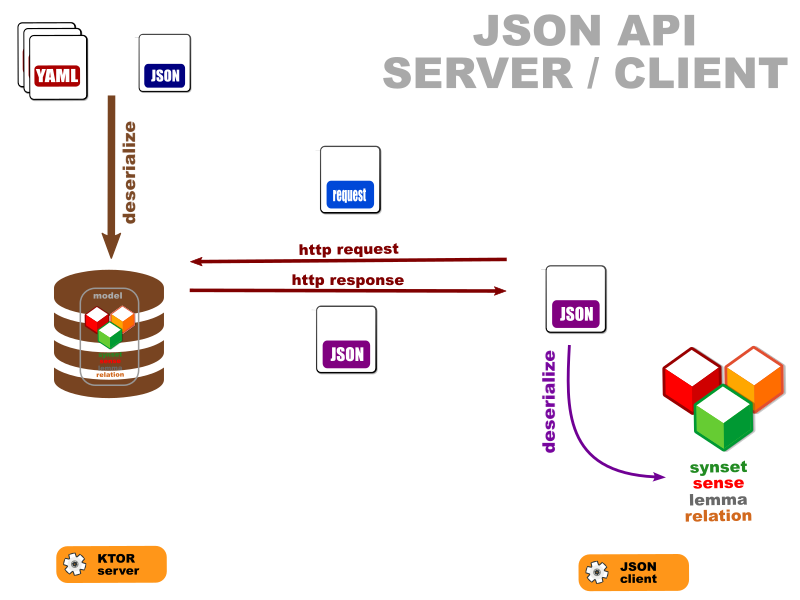

# OEWN JSON API server

This is a JSON-API based server.

Project [server](https://github.com/oewntk/server)

# OEWN JSON API

JSON-API based server.

|Request|URL               |Parameter                         |Returns             |
|-------|------------------|----------------------------------|--------------------|
|get    |/                 |none                              |"OEWN"              |      
|get    |/api/synset/{id}  |synsetid                          |synset              | 
|get    |/api/sense/{id}   |sensekey                          |sense               |
|get    |/api/lex/{id}     |lemma,part-of-speech[discriminant]|lex (unique)        | 
|get    |/api/word/{lemma} |lemma                             |collection of lexes |

*discriminant* differentiates entries having same part-of-speech but different properties (like pronunciation). It starts with a dash and ends with a number.

# Prefer request header

|Prefer header           |Returns                          |
|------------------------|---------------------------------|
|none                    |model                            |  
|mode=model              |model                            | 
|mode=oewn               |oewn (sense embedded within lex) | 
|mode=data               |flat data                        | 
|mode=data,method=typed" |flat typed data                  | 

## Dataflow

## Maven Central

		<groupId>io.github.oewntk</groupId>
		<artifactId>server</artifactId>
		<version>3.0.1</version>
