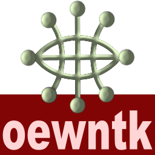

# OEWN JSON API server

This is a JSON-API based server.

Project [server](https://github.com/oewntk/server)

Project [client](https://github.com/oewntk/client)

# OEWN JSON API

JSON-API based server.

| Request | URL               | Parameter                          | Returns             |
|---------|-------------------|------------------------------------|---------------------|
| get     | /                 | none                               | "OEWN"              |      
| get     | /api/synset/{id}  | synsetid                           | synset              | 
| get     | /api/sense/{id}   | sensekey                           | sense               |
| get     | /api/lex/{id}     | lemma,part-of-speech[discriminant] | lex (unique)        | 
| get     | /api/word/{lemma} | lemma                              | collection of lexes |

*discriminant* differentiates entries having same part-of-speech but different properties (like pronunciation). It starts with a dash and ends with a number.

# Prefer request header

| Prefer header          | Returns                          |
|------------------------|----------------------------------|
| none                   | model                            |  
| mode=model             | model                            | 
| mode=oewn              | oewn (sense embedded within lex) | 
| mode=data              | flat data                        | 
| mode=data,method=typed | flat typed data                  | 

## Launch configuration

You can override parameters from application.yaml at runtime by passing -P: arguments to your application jar, or by passing JVM system properties with -D

`java -jar oewn-server-3.0.1-uber.jar -P:ktor.deployment.port=9090
`

`java -jar oewn-server-3.0.1-uber.jar -P:model.path=oewn-model.json -P:model.type=json -P:model.subtype=model
`

`java -jar oewn-server-3.0.1-uber.jar -P:model.path=yaml_model -P:model.type=yaml
`
 The relevant parameters are:

| Parameter            | Uses                            | Default         |
|----------------------|---------------------------------|-----------------|
| ktor.deployment.port | the port the server listens on  | 8080            | 
| model.path           | model                           | oewn-model.json |
| model.type           | json \| yaml                    | json            |
| model.subtype        | json format (model\|data\|oewn) | model           |

## Dataflow

## Maven Central

		<groupId>io.github.oewntk</groupId>
		<artifactId>server</artifactId>
		<version>3.0.1</version>

## Dependencies

